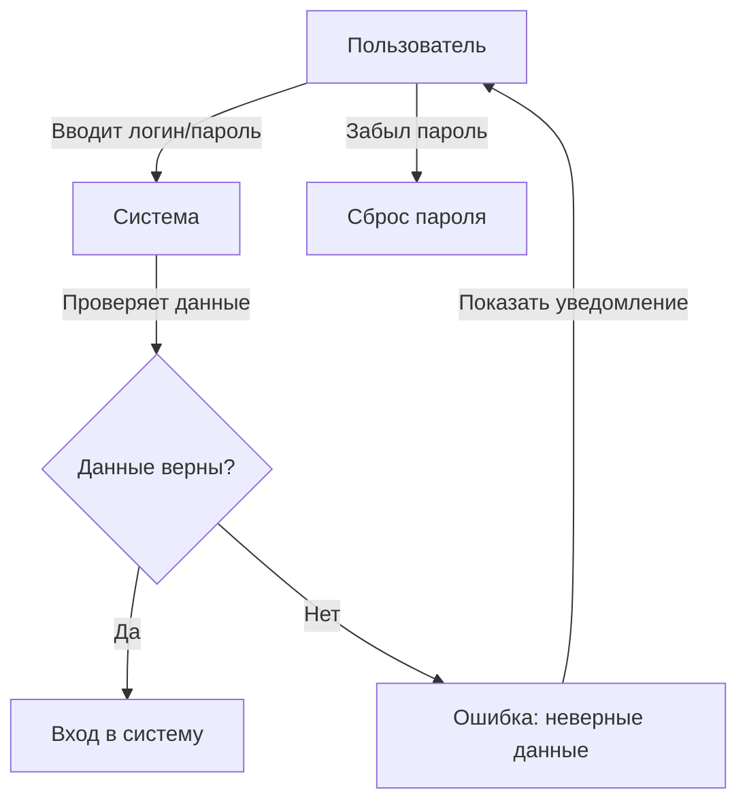
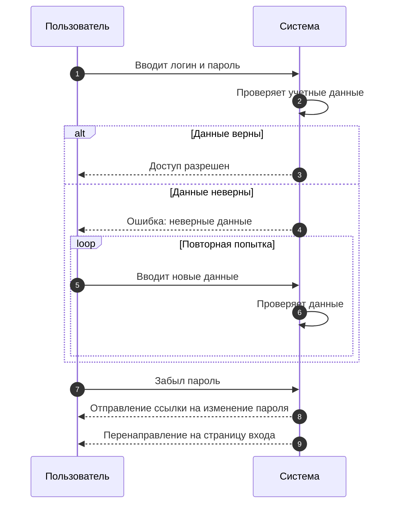

# 🔑 Вход в систему

## 📌 Основной сценарий:
1. Пользователь вводит логин и пароль
2. Система проверяет учетные данные
3. При успешном входе перенаправляет в CRM

## ❌ Ошибки:
- **Неверные логин или пароль** → Показать ошибку
- **Забыл пароль** → Перенаправить на [Восстановление доступа](password-recovery.md)

## 🔷 Прецеденты

## 🔷 Последовательности

