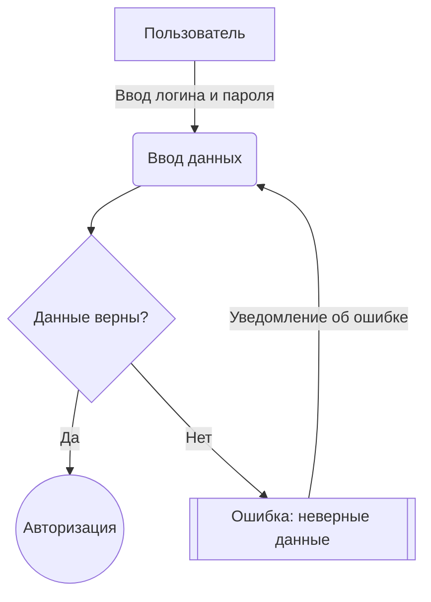
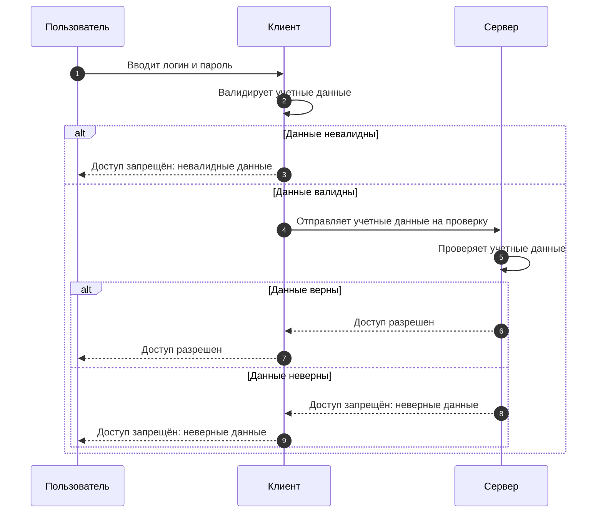

# 🔑 Вход в систему

## 📜 Сценарий
1. Пользователь находится на странице входа в систему;
2. Пользователь вводит логин и пароль;
3. Пользователь проходит авторизацию.

## ❌ Ошибки
- **Неверные логин или пароль** → Показать ошибку.

## 🔷 Прецедент

## 🔷 Последовательность

