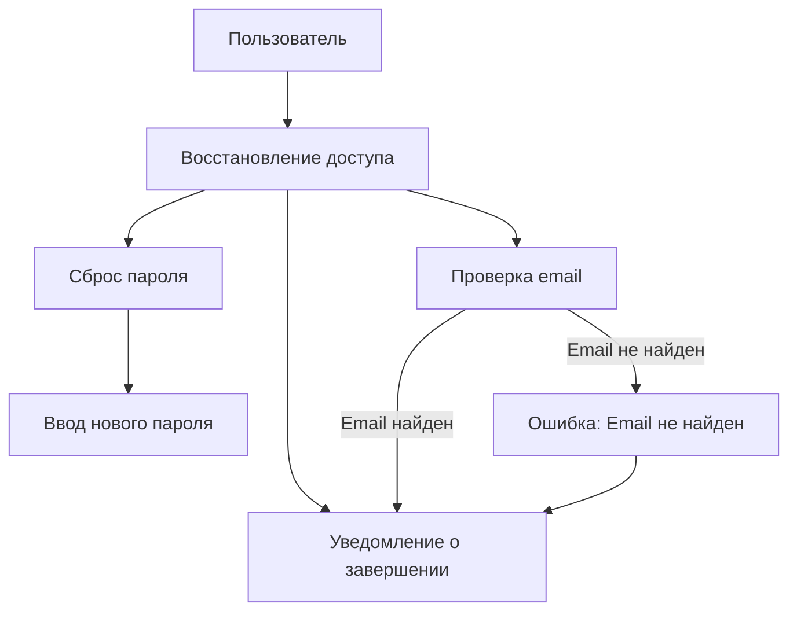
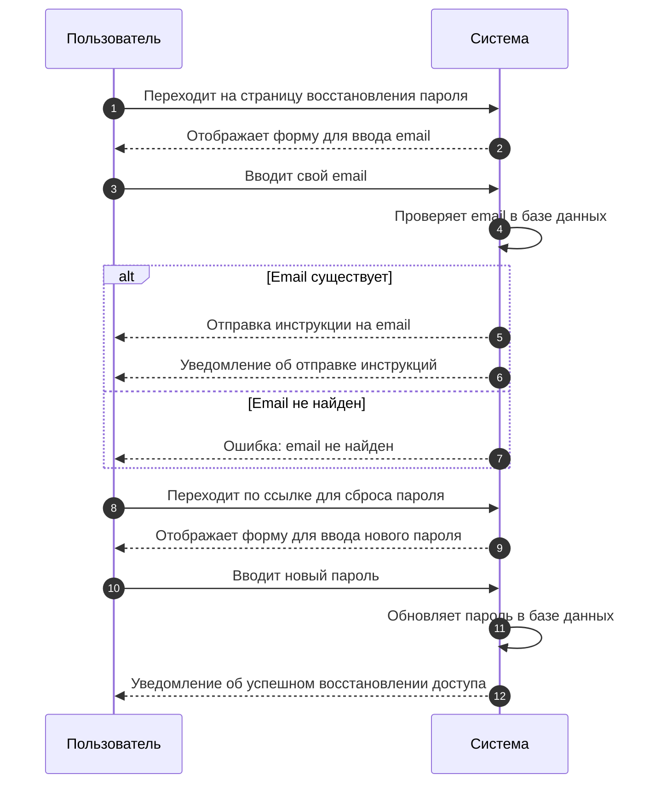

# 🔐 Восстановление доступа

Если пользователь забыл свой пароль или не может войти в систему, он может выполнить следующие шаги для восстановления доступа:

## 📌 Шаг 1: Перейти на страницу восстановления пароля
Находясь на странице входа в систему, пользователь должен нажать на **"забыли пароль?"**, чтобы начать процесс восстановления пароля.

## 📧 Шаг 2: Ввести адрес электронной почты
На странице восстановления пароля пользователь должен ввести адрес электронной почты, связанный с его учетной записью.

## 📩 Шаг 3: Получить ссылку для сброса пароля
После отправки запроса на восстановление, пользователю будет отправлено письмо с инструкциями и ссылкой для сброса пароля.

## 📖 Шаг 4: Следовать инструкциям в письме
Пользователь должен открыть письмо и перейти по ссылке для сброса пароля. На странице сброса он сможет установить новый пароль для своей учетной записи.

## 🔑 Шаг 5: Ввести новый пароль
После перехода по ссылке, пользователь должен ввести новый пароль. Он должен убедиться, что пароль надежный и соответствует всем требованиям безопасности.

## ✅ Шаг 6: Войти в систему
После успешного сброса пароля пользователь сможет войти в систему с использованием нового пароля.

## 🔷 Прецеденты

## 🔷 Последовательности

---

Если у пользователя возникли вопросы или проблемы, он может связаться с нашей службой поддержки.

[📞 Связаться с поддержкой](mailto:support@legalex.by)

---

**⚠️ Важно!** Если письмо для сброса пароля не было получено, пользователю следует проверить папку "Спам" в почтовом ящике.
