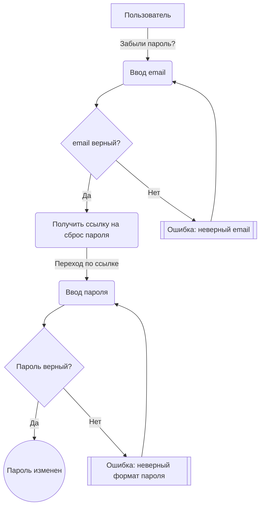
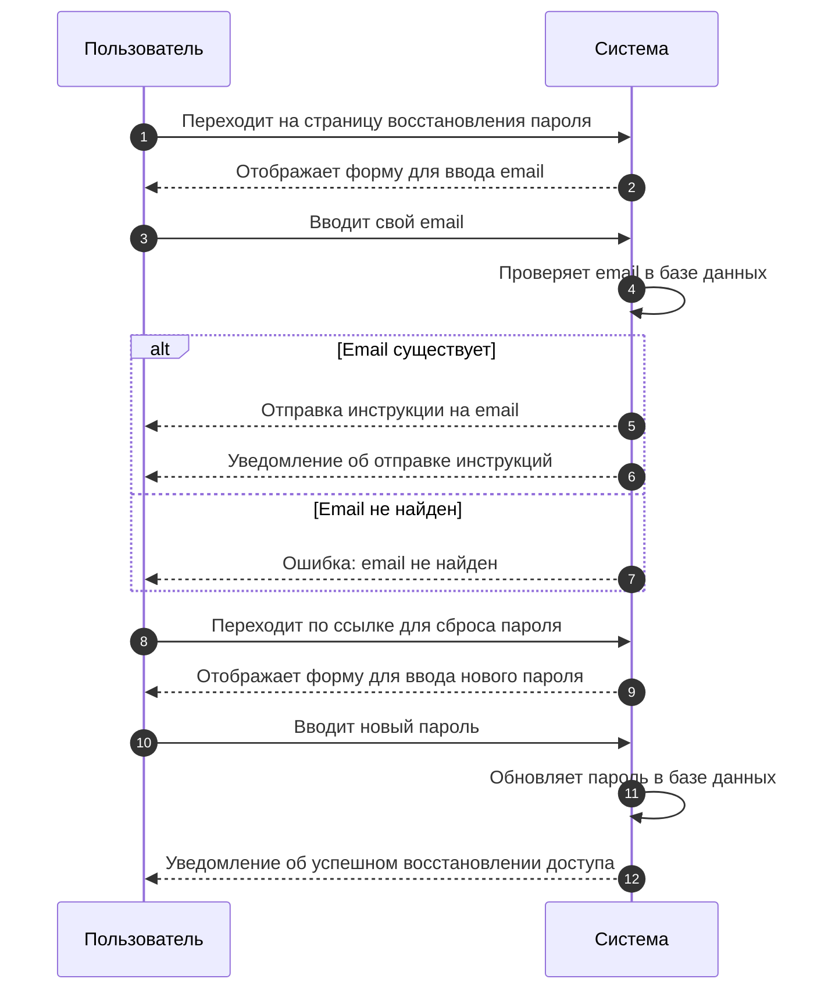

# 🔐 Восстановление доступа

## 📜 Сценарий
1. Пользователь находится на странице входа в систему;
2. Пользователь нажимает на **"забыли пароль?"**;
3. Пользователь вводит email для получения ссылки;
4. Пользователь получает ссылку на изменение пароля;
5. Пользователь переходит по ссылке и вводит новый пароль.

## ❌ Ошибки
- **Неверный email** → Показать ошибку;
- **Неверный текущий пароль** → Показать ошибку;
- **Неверный новый пароль** → Показать ошибку.

## 🔷 Прецедент

## 🔷 Последовательности

---

Если у пользователя возникли вопросы или проблемы, он может связаться с нашей службой поддержки.

[📞 Связаться с поддержкой](mailto:support@legalex.by)

---

**⚠️ Важно!** Если письмо для сброса пароля не было получено, пользователю следует проверить папку "Спам" в почтовом ящике.
