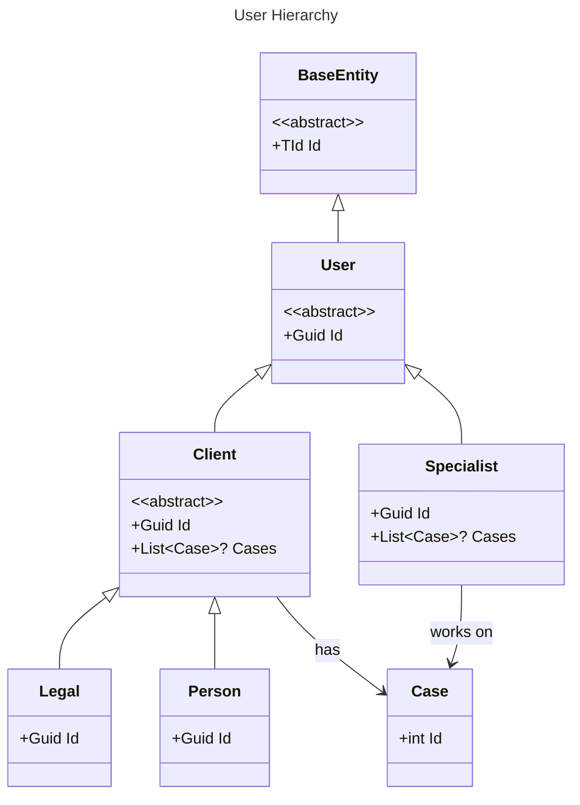

# 📖 Главная

Здесь описаны основные модели в доменной области приложения.

```mermaid
---
title: User Hierarchy
---
classDiagram
    class BaseEntity {
        &lt;&lt;abstract&gt;&gt;
        +TId Id
    }

    class User {
        &lt;&lt;abstract&gt;&gt;
        +Guid Id
    }

    class Client {
        &lt;&lt;abstract&gt;&gt;
        +Guid Id
        +List~Case~? Cases
    }

    class Legal {
        +Guid Id
    }

    class Person {
        +Guid Id
    }

    class Specialist {
        +Guid Id
        +List~Case~? Cases
    }

    class Case {
        +int Id
    }

    %% Наследование от BaseEntity
    BaseEntity <|-- User

    %% Наследование пользователей
    User <|-- Client
    User <|-- Specialist
    Client <|-- Legal
    Client <|-- Person

    %% Связь с делами
    Client --> Case : has
    Specialist --> Case : works on
```
