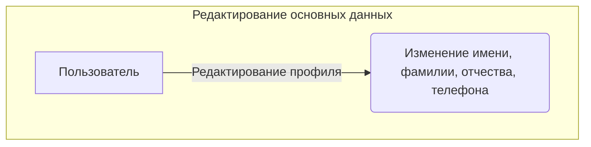
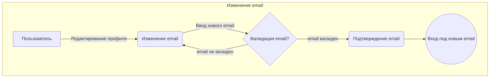
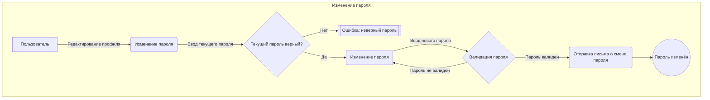
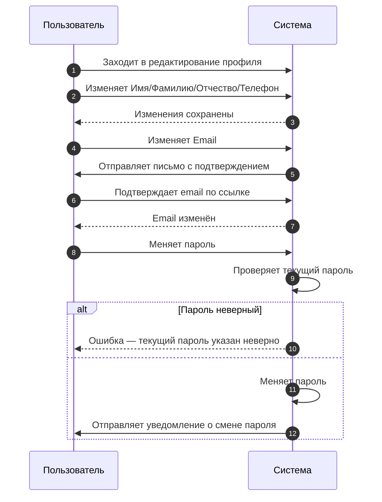

#  ✏️ Редактирование профиля

## 📌 Функциональные возможности:
1. Могут быть изменены без дополнительного подтверждения:
    - Имя;
    - Фамилия;
    - Отчество;
    - Телефон.
2. Email можно изменить, но для этого требуется подтверждение нового адреса.
3. При смене пароля, на указанный email-адрес приходит уведомление о том, что пароль был изменён.

## ❌ Ошибки:
- **Пользователь с таким email уже есть** → Показать ошибку.
- **Такого email не существует (отправить сообщение не удалось)** → Показать ошибку.
- **При попытке изменить пароль, текущий пароль был указан неверно** → Показать ошибку.

## 🔷 Прецедент

## 🔷 Прецедент

## 🔷 Прецедент

## 🔷 Последовательности

**⚠️ Важно!** Изменение email требует дополнительного подтверждения для безопасности.